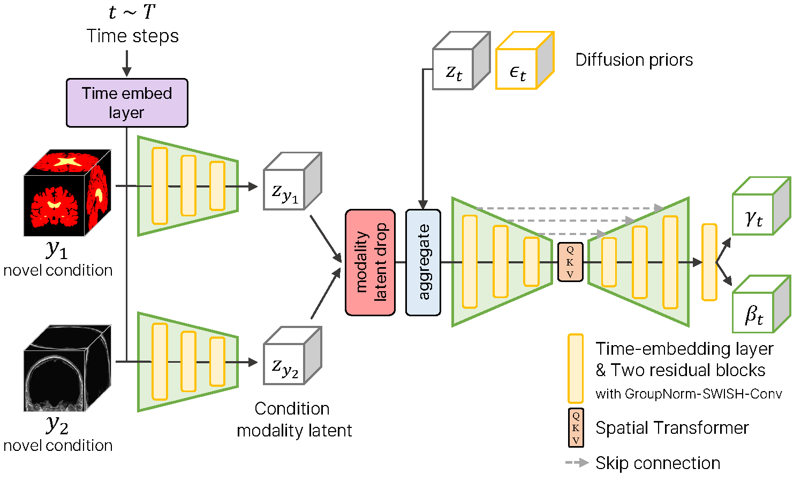

# Volumetric Conditioning Module to Control Pretrained Diffusion Models for 3D Medical Images
Anonymous WACV Applications Track submission Paper ID 1551 for reproducibility of Volumetric Conditioning Module (VCM)




## 1. installation

### a. enviroment setup
```
conda create -n vcm python=3.12 -y
conda activate vcm
python setup.py install
```

### b. accelerate setup

run `accelerate config` command in your shell for accelerate configuration

```
----------------------------------------------------------------------------------------------------------------------------------
In which compute environment are you running?
This machine                                                                                                                                                                                                            
----------------------------------------------------------------------------------------------------------------------------------
Which type of machine are you using?                                                                                                                                                                                          
multi-GPU                                                                                                                                                                                                               
How many different machines will you use (use more than 1 for multi-node training)? [1]: 1                                                                                                                              
Should distributed operations be checked while running for errors? This can avoid timeout issues but will be slower. [yes/NO]: yes                                                                                      
Do you wish to optimize your script with torch dynamo?[yes/NO]:NO                                                                                                                                                       
Do you want to use DeepSpeed? [yes/NO]: NO                                                                                                                                                                              
Do you want to use FullyShardedDataParallel? [yes/NO]: NO                                                                                                                                                               
Do you want to use Megatron-LM ? [yes/NO]: NO                                                                                                                                                                           
How many GPU(s) should be used for distributed training? [1]:4                                                                                                                                                          
What GPU(s) (by id) should be used for training on this machine as a comma-seperated list? [all]:'0,1,2,3'                                                                                                              
Would you like to enable numa efficiency? (Currently only supported on NVIDIA hardware). [yes/NO]: NO
-----------------------------------------------------------------------------------------------------------------------------------
Do you wish to use FP16 or BF16 (mixed precision)?
bf16                                                                                                                                                                                                                    
accelerate configuration saved at /root/.cache/huggingface/accelerate/default_config.yaml
```

## 2. donwload weights